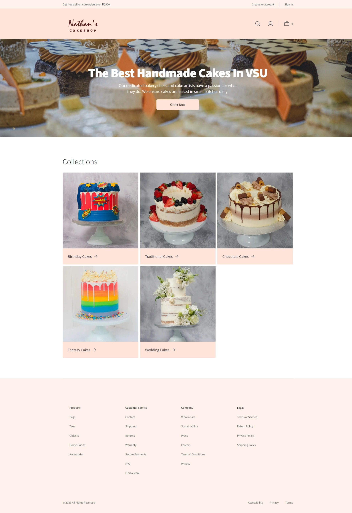
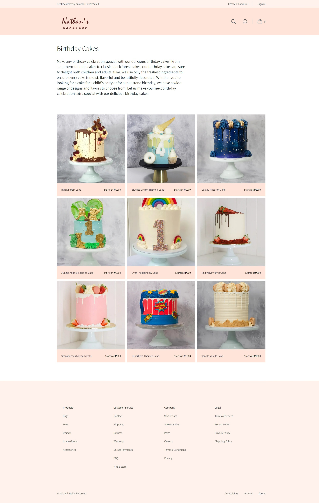
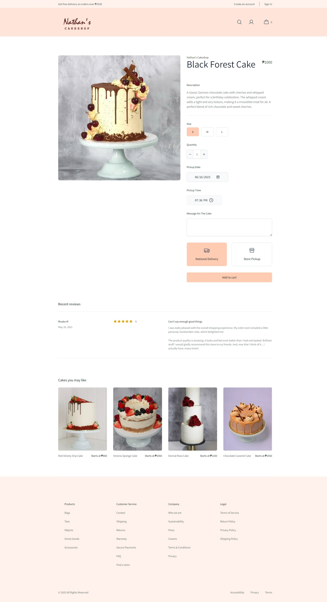
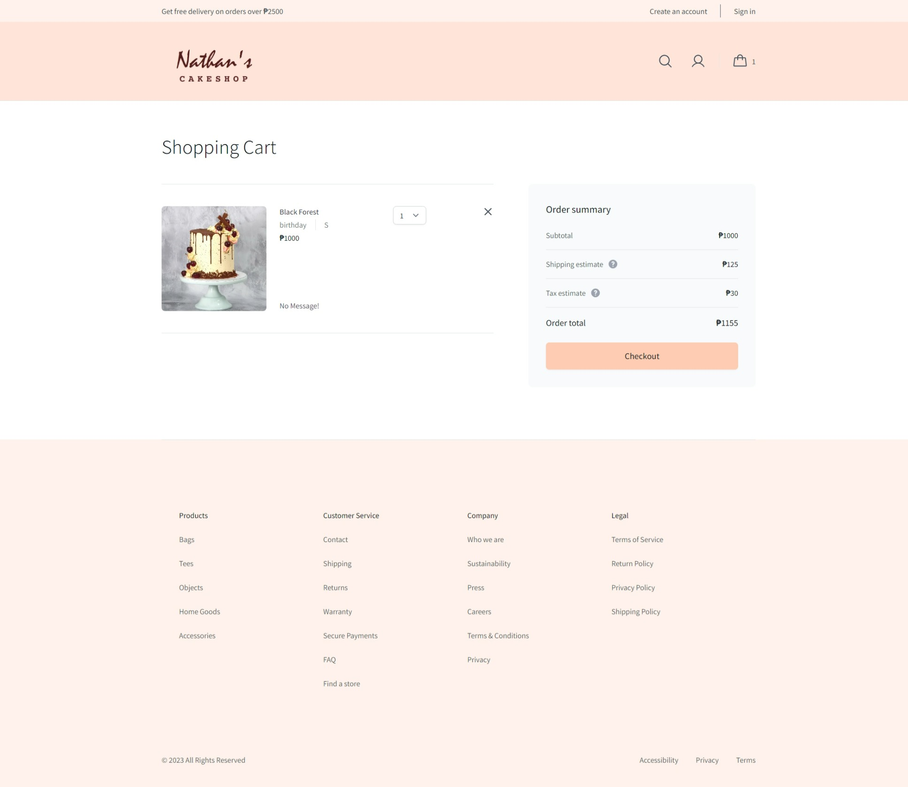

# Nathan Desserts

This is a demo web project for the CSci 153 - Web Systems and Technologies course at the Visayas State University.
Tech Stack: Vue.js, Node.js, TailwindCSS

## Project setup
```
npm install
```

### Compiles and hot-reloads for development
```
npm run serve
```

### Compiles and minifies for production
```
npm run build
```

## Page Screenshots






